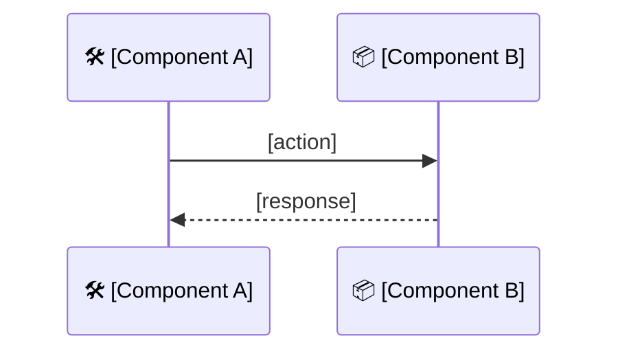

# PR Template

> Author guidance: keep sections that have real content from the diff; **delete sections that don't apply**. Match the tone and emoji style of the examples in `ai/commands/create-pr.md`. Open with a one-line hero title (use the leading emoji that matches the archetype: 🚀 new feature · ⚡ performance · 🐛 bug fix · 🧱 refactor · 🛡️ security · 📚 docs).

---

## Title

`[type][(optional-scope)]: [imperative, single-line summary — under 80 chars]`

Type is required and must be one of: `feat`, `fix`, `chore`, `refactor`, `perf`, `docs`, `test`, `build`, `ci`, `style`, `revert`. No leading emoji on the title.

Examples:
- `feat: decouple templates from channel`
- `feat(communication-flow): in-process cache for execution rows`
- `perf: reduce render hot-path DB load with singleflight`
- `fix: stop double-dispatching on River retry after partial outbox write`
- `chore(seeds): refresh template and flow seed data`

---

## Description

### [emoji] [One-line hero title]

[1–2 sentence pitch — what this PR does and what it unlocks at production scale. Mirror the language of `<example1/>` and `<example2/>` from the create-pr command.]

## 🎯 Why

[The motivation. Lead with the user / operational pain, not the code change. Quantify when possible — load, scale, incident frequency, cost. 3–6 sentences max.]

## 🧩 How it works

[Optional but encouraged for multi-step flows. Use a `mermaid` `sequenceDiagram` to show the new path. Label participants with emojis for scannability.]

[Or, for non-sequenced changes, replace the diagram with a short paragraph or a bulleted "what changes in the request path" list.]

## 🔑 Key points

- 🧠 **[Property]** — [one-line explanation]
- 🔁 **[Property]** — [one-line explanation]
- 🪂 **[Property]** — [one-line explanation, including any subtle correctness argument]
- 🪜 **[Property]** — [one-line explanation]
- 🧊 **[Property]** — [one-line explanation]

## ⚙️ Configuration

[Omit if no new config keys.]

| Key | Default | Purpose |
|---|---|---|
| `[config.key]` | `[value]` | [one-line purpose] |
| `[config.key]` | `[value]` | [one-line purpose] |

## 🗄️ Data model

[Omit if no migrations. List new migrations, tables, columns, and any non-obvious constraints — UNIQUE, NOT NULL, foreign keys, optimistic-lock columns.]

- 📋 `[table_name]` — [purpose, key constraints]
- 📸 `[table_name]` — [purpose, key constraints]

## 🌐 Surface area

[Omit if no API/RPC changes. List new endpoints / RPC methods / admin routes / middleware.]

- 🔵 **HTTP** — `METHOD /path`
- 🟣 **gRPC** — `ServiceMethodName`
- 🛠️ **Admin HTTP** — `[route]`

## 🛡️ Retry safety

[Omit if not applicable. Use a table when there are multiple boundaries.]

| Boundary | Mechanism |
|---|---|
| 🔁 [Boundary] | [Mechanism — idempotency key, UNIQUE constraint, short-circuit, etc.] |
| 🚫 [Boundary] | [Mechanism] |

## 📊 Observability

[Omit if no new metrics/dashboards. Cite metric names exactly as declared in `metrics.gen.yaml`.]

- `[metric_name]` ✅ — [purpose]
- `[metric_name]` ❌ — [purpose]
- Grafana: [new panel / new row name]
- Alerts: [new alert name and what it fires on]

## 🐛 Root cause and fix

[Use only for bug-fix archetype. Replaces "How it works".]

- **Root cause**: [precise description of the bug]
- **Failure scenario**: [realistic reproduction — what the user / system observed]
- **Fix**: [the change and why it closes the failure mode]

## 🧱 Migration / rollout notes

[Use for refactor or breaking-change archetype.]

- **Backwards compatibility**: [yes / no — describe the bridge if no]
- **Deploy order**: [any service-A-before-service-B requirements]
- **Rollback plan**: [how to revert safely]

## 🎁 Also included

[Optional. Small adjacent changes bundled with the main one. Keep to bullets.]

- [Small thing 1]
- [Small thing 2]

---

<!-- This is an auto-generated comment: release notes by coderabbit.ai -->
## Summary by CodeRabbit

[Leave this section empty — CodeRabbit fills it in on the live PR.]
<!-- end of auto-generated comment: release notes by coderabbit.ai -->
